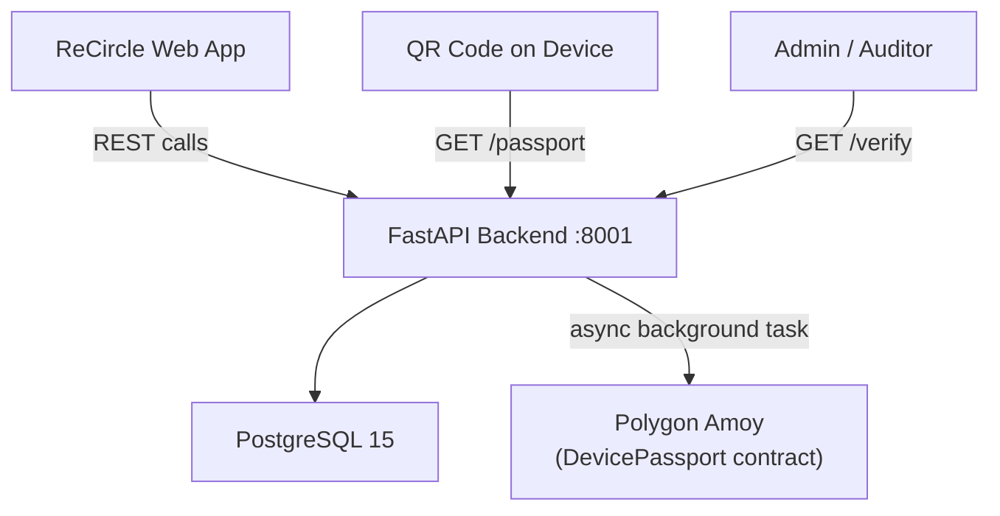
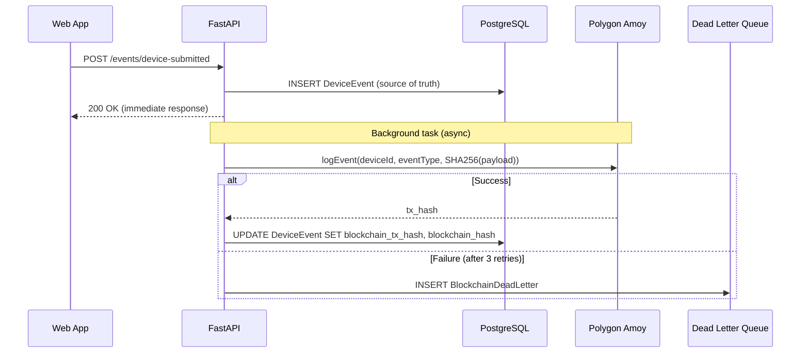

# Device Passport — Blockchain Event Logging Layer

## What Was Built

A complete **on-chain event logging system** for the ReCircle e-waste platform. Every device lifecycle action is permanently recorded on Polygon Amoy via a [DevicePassport](file:///c:/Users/anmol/OneDrive/Desktop/Work/data_sec/backend/app/schemas/dto.py#221-227) smart contract that emits events. No sensitive data goes on-chain — only SHA-256 hashes of off-chain records are anchored.



---

## Project Structure (28 files)

```
data_sec/
├── contracts/
│   ├── DevicePassport.sol          ← Event-emission-only smart contract
│   └── DevicePassport.abi.json     ← ABI for web3.py
├── scripts/deploy.js               ← Hardhat deploy to Polygon Amoy
├── hardhat.config.js               ← Polygon Amoy network config
├── package.json                    ← Hardhat dependencies
├── docker-compose.yml              ← PostgreSQL + backend containers
├── .env / .env.example             ← All config vars
└── backend/
    ├── main.py                     ← FastAPI app entry point
    ├── Dockerfile
    ├── requirements.txt
    └── app/
        ├── core/
        │   ├── config.py           ← Pydantic-settings (wallets, RPC, contract)
        │   └── security.py         ← Admin API key dependency
        ├── db/
        │   ├── base.py             ← SQLAlchemy DeclarativeBase
        │   └── session.py          ← Async engine + session dependency
        ├── models/
        │   └── entities.py         ← DeviceEvent + BlockchainDeadLetter ORM
        ├── schemas/
        │   └── dto.py              ← 12 Pydantic payload models + responses
        ├── services/
        │   └── blockchain_service.py ← Singleton: log_event, get_history, verify
        ├── utils/
        │   ├── hashing.py          ← Deterministic SHA-256 + bytes32 conversion
        │   └── retry.py            ← Exponential backoff retry helper
        └── api/routes/
            └── events.py           ← All 14 API endpoints
```

---

## API Endpoints (14 total)

### Event Logging (11 POSTs)

| Endpoint | Event Type | Actor |
|----------|-----------|-------|
| `POST /api/v1/events/device-submitted` | DEVICE_SUBMITTED | PLATFORM_WALLET |
| `POST /api/v1/events/device-dropped-off` | DEVICE_DROPPED_OFF | PARTNER_WALLET |
| `POST /api/v1/events/device-picked-up` | DEVICE_PICKED_UP | AGENT_WALLET |
| `POST /api/v1/events/device-graded` | DEVICE_GRADED | PARTNER_WALLET |
| `POST /api/v1/events/data-wiped` | DATA_WIPED | PARTNER_WALLET |
| `POST /api/v1/events/device-repaired` | DEVICE_REPAIRED | PARTNER_WALLET |
| `POST /api/v1/events/device-listed` | DEVICE_LISTED | PARTNER_WALLET |
| `POST /api/v1/events/device-sold` | DEVICE_SOLD | PLATFORM_WALLET |
| `POST /api/v1/events/device-batched` | DEVICE_BATCHED_FOR_RECYCLING | PARTNER_WALLET |
| `POST /api/v1/events/batch-dispatched` | BATCH_DISPATCHED_TO_RECYCLER | PLATFORM_WALLET |
| `POST /api/v1/events/recycler-acknowledged` | RECYCLER_ACKNOWLEDGED_RECEIPT | RECYCLER_WALLET |
| `POST /api/v1/events/epr-certificate` | EPR_CERTIFICATE_ISSUED | PLATFORM_WALLET |

### Verification & Passport

| Endpoint | Purpose |
|----------|---------|
| `GET /api/v1/verify/{device_id}` | Full event history with per-event verification status |
| `GET /api/v1/passport/{device_id}` | Public device passport (PII redacted, blockchain proof links) |
| `GET /api/v1/admin/dead-letters` | Failed blockchain writes for admin triage |

---

## Data Flow (per event)



---

## Verification Results

- ✅ All 8 core Python source files pass `py_compile` with zero errors
- ✅ 28 files in final project tree
- ✅ Complete Pydantic validation on all 12 event payloads
- ✅ Dead-letter queue prevents blockchain failures from breaking API operations

## Deployment

### Smart Contract

```bash
cd data_sec
npm install
npx hardhat compile
npx hardhat run scripts/deploy.js --network amoy
# Copy printed address → .env CONTRACT_ADDRESS
```

### Backend

```bash
docker-compose up --build
# API at http://localhost:8001
# Swagger docs at http://localhost:8001/docs
```
